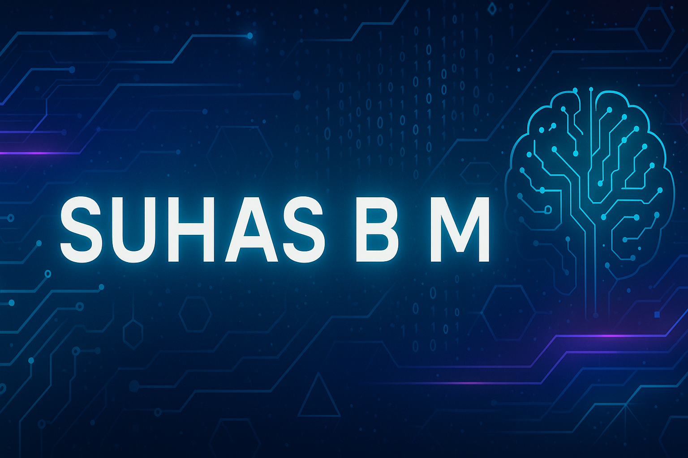

  

<h1 align="center">Hey, I’m Suhas B M 👋</h1>

<strong>Final Year CSE </strong>

---

## 🧠 About Me

I'm Suhas, a Computer Science student from NIE, Mysuru.  
I design and ship full-stack systems that merge AI, blockchain, and clean software architecture.

Every line of code I write—from backend APIs to Anchor smart contracts—is built for **scalability**, **clarity**, and **impact**.

---

## ⚙️ Tech Stack

<table align="center">
  <tr>
    <td align="center"> C</td>
    <td align="center"> C++</td>
    <td align="center"> Python</td>
    <td align="center"> JavaScript</td>
    <td align="center"> Rust</td>
  </tr>
  <tr>
    <td align="center"> React</td>
    <td align="center"> TailwindCSS</td>
    <td align="center"> Node.js</td>
    <td align="center"> Flask</td>
    <td align="center"> Anchor</td>
  </tr>
  <tr>
    <td align="center"> Solana CLI</td>
    <td align="center"> Firebase</td>
    <td align="center"> MongoDB</td>
    <td align="center"> MySQL</td>
    <td align="center"> Docker</td>
  </tr>
  <tr>
    <td align="center"> Jenkins</td>
    <td align="center"> Git</td>
    <td align="center"> GitHub</td>
    <td align="center"> Linux</td>
    <td></td>
  </tr>
</table>

---

## 🚀 Projects

- 🔗 **[SkillFlex](https://github.com/suhasbm09/SKILL_FLEX)**  
  A Solana-based AI credentialing system that mints soulbound NFTs on skill completion.

- 💊 **[Vionex](https://github.com/suhasbm09/Vionex)**  
  A decentralized medicine donation platform with AI matcher and blockchain-backed traceability.

- 🎓 **[College_Chatbot](https://github.com/suhasbm09/College_Chatbot)**  
  AI-driven chatbot for campus info powered by OpenRouter and RAG.

- 💬 **[AI Code Commenter](https://github.com/suhasbm09/ai-code-commentor)**  
  Flask app that auto-generates inline code comments using LLM APIs.

- ✍️ **[AI Auto-Correct Tool](https://github.com/suhasbm09/AutoCorrect-tool)**  
  T5-based NLP corrector for spelling, grammar, and code.

---

## 📊 GitHub Stats

  

---

## 📈 Roadmap

- **SkillFlex v2**  
  - AI-generated NFT metadata & certificates  
  - Multi-chain credentials (Solana ↔ Ethereum)

- **Vionex 2.0**  
  - DAO-based decentralized governance  
  - zk receipts for donor privacy & transparency

---

## 📫 Contact

- 📧 [suhasbannihattimurali@gmail.com](mailto:suhasbannihattimurali@gmail.com)  
- 🔗 [LinkedIn](https://www.linkedin.com/in/suhas-b-m-88a179244)  
- 🌐 [Portfolio](https://portfolio-suhasbm.vercel.app)

---

  Built with code, curiosity, and care - for systems that scale.

